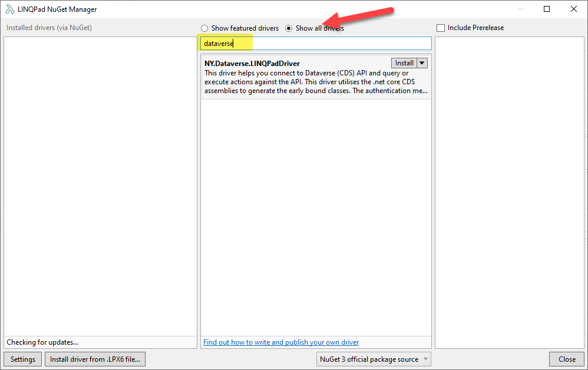

# Dataverse Driver for LINQPad 6

[The original LINQPad Driver for Dynamics CRM](https://github.com/kenakamu/CRMLinqPadDriver) (as Dataverse was known back then) was written by [Kenichiro Nakamura](https://github.com/kenakamu). It used the SOAP endpoint along with CrmSvcUtil to generate the early bound classes needed to show the entities in LINQPad. It was a static driver, meaning that you had to regenerate the context if you had new metadata e.g. new fields, entities etc.

This new driver is a dynamic driver that uses [Microsoft.PowerPlatform.Dataverse.Client](https://github.com/microsoft/PowerPlatform-DataverseServiceClient) assemblies which targets .NET 5. The Tables (Entities) and associated metadata are regenerated everytime LINQPad is opened, so that you don't need to worry about keeping Dataverse Metadata and LINQPad context in sync.

# Installing

You can install the driver from LINQPad from nuget. Click on View more drivers, and then choose "Show all drivers". Search for Dataverse and you should be able to see the driver and install it.




# Connecting to your Dataverse Environment

[Microsoft.PowerPlatform.Dataverse.Client](https://github.com/microsoft/PowerPlatform-DataverseServiceClient) supports four kinds of authentication:

1. Application Id/Secret
2. Application Id/Certificate Thumbprint
3. OAuth
4. Azure

After installing the driver from nuget, you can start using this driver by clicking _Add Connection_ link on LINQPad. You will be presented with the dialog below.


The easiest way to connect is to use the credentials you already have in Azure CLI. You can get the currently signed on user in Az CLI using the
command below.

```
az ad signed-in-user show --query "{login: userPrincipalName, name: displayName}" --output table
```

This should display something like below.


If you choose Azure connection method, you only need to enter the environment URL e.g. https://env.crm.dynamics.com. If you choose any other connection method, you have to enter the appropriate details i.e. AppId/Secret, Certification Thumbprint etc.

# Running LINQ Query

After entering the required details on the connection dialog, the context would be generated and you should see all the tables on the left hand side.


You can either write a new LINQ query on the query window, or right click on the table name, to see some quick suggestions.


LINQPad has a whole bunch of samples on how to craft your LINQ queries, in case you don't know how to query in LINQ and want to learn the syntax. LINQ is very similar to SQL in syntax, but more powerful than SQL.


I have also given five samples that illustrate the power of LINQPad and how you can use the driver to query Dataverse.


I highly recommend that you purchase [LINQPad Premium](https://www.linqpad.net/Purchase.aspx), as you get both Intellisense and Debugging capability. It is great for quick PoCs and experimentation. I currently get a free Premium licence as a Microsoft MVP, but I had paid for Premium licence even before I became a Microsoft MVP.

# Calling Dataverse API

You can use _DataverseClient_ property to access the ServiceClient object. Once you have access to this object you can then basically do any operations that are supported by the client.


# Getting FetchXML/WebAPI URL from LINQ

If you click on the SQL tab, you can see both WebAPI URL and FetchXML that correspond to the LINQ query that you ran.


# Thank You

- [Mark Carrington](https://github.com/MarkMpn) for [FetchXML to WebAPI URL conversion logic](https://github.com/MarkMpn/MarkMpn.FetchXmlToWebAPI)
- [Kenichiro Nakamura](https://github.com/kenakamu) for writing the original CRM driver for LINQPad 4.
- [Gayan Perara](https://www.linkedin.com/in/gperera/) for CRM Code Generator, which was the first one to use T4 templates for generating early bound classes
- [Joe Albahari](http://www.albahari.com/) for creating LINQPad and providing Microsoft MVPs with Premium licence
- People who helped me with testing - [Tae Rim Han](https://twitter.com/taerimhan)
